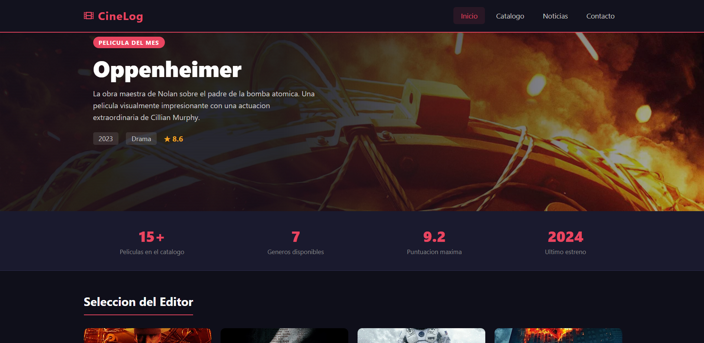

<div align="center">
  <h1>CineLog</h1>
  <p>A movie catalog web application built with React JS</p>
  <p>
    <a href="#demo">Live Demo</a> ·
    <a href="#about">About</a> ·
    <a href="#getting-started">Getting Started</a>
  </p>
  
  
  
</div>

---

## About The Project

CineLog is a movie catalog application that allows users to discover, search, and manage a collection of films. The app features a clean dark theme inspired by movie theater aesthetics.

**Main page screenshot:**



### Key Features

- Full CRUD operations on a movies database (create, read, update, delete)
- Search and filter movies by title, director, and genre
- Live RSS news feed from BBC Entertainment
- Interactive map showing the company location (powered by Leaflet)
- Fully responsive design for mobile, tablet, and desktop
- Dark cinema-inspired theme

---

## Pages

| Page | Route | Description |
|---|---|---|
| Home | `/` or `/home` | Landing page with featured movies and a category filter |
| Catalog | `/catalogo` | Full CRUD operations on the movie database (Firebase) |
| News | `/noticias` | Live RSS feed from BBC Entertainment and Arts |
| Import/Export | `/importar-exportar` | Import and export data in JSON, CSV and XML format |
| Contact | `/contacto` | Contact form and interactive map |

---

## Third-party Components

- **[React Router DOM](https://reactrouter.com/)** - Client-side routing between pages
- **[React Leaflet](https://react-leaflet.js.org/)** - Interactive map on the contact page
- **[Leaflet](https://leafletjs.com/)** - The underlying map library used by React Leaflet
- **[React Icons](https://react-icons.github.io/react-icons/)** - Icon library (Font Awesome icons used throughout the app)
- **[rss2json API](https://rss2json.com/)** - Free RSS-to-JSON proxy used to load the BBC RSS feed without CORS issues
- **[Firebase](https://firebase.google.com/)** - Cloud Firestore database for storing movie data and Firebase Hosting
- **[PapaParse](https://www.papaparse.com/)** - CSV parsing and generation for import/export functionality
- **[fast-xml-parser](https://github.com/NaturalIntelligence/fast-xml-parser)** - XML parsing and generation for import/export functionality

---

## Figma Design Inspiration

The design was inspired by this Figma template:

- [Movie App UI - Figma Community](https://www.figma.com/community/file/1166604455747957416)

---

## Tutorials That Helped

- [React Router v6 Tutorial - Official Docs](https://reactrouter.com/en/main/start/tutorial)
- [Getting Started with React Leaflet](https://react-leaflet.js.org/docs/start-introduction/)
- [Best README Template by othneildrew](https://github.com/othneildrew/Best-README-Template)
- [How to consume RSS feeds in React using the rss2json API](https://rss2json.com/)
- [CSS Flexbox Guide - CSS-Tricks](https://css-tricks.com/snippets/css/a-guide-to-flexbox/)
- [Leaflet marker icon fix for Vite projects - Stack Overflow](https://stackoverflow.com/questions/49441600/react-leaflet-marker-files-not-found)
- [Firebase Firestore Get Started - Official Docs](https://firebase.google.com/docs/firestore/quickstart)
- [PapaParse Documentation](https://www.papaparse.com/docs)
- [fast-xml-parser Documentation](https://github.com/NaturalIntelligence/fast-xml-parser)

---

## Getting Started

### Prerequisites

- Node.js 18 or higher
- npm 9 or higher

### Installation

1. Clone the repository

   ```bash
   git clone https://github.com/pablo-tapia-manchado/cinelog.git
   cd cinelog
   ```

2. Install dependencies

   ```bash
   npm install
   ```

3. Start the development server

   ```bash
   npm run dev
   ```

4. Open your browser at `http://localhost:5173`

---

## Firebase Deployment

This project is hosted on Firebase Hosting.

**Live URL:** https://cinelog-80cad.web.app
**Optional Live URL:** https://cinelog-80cad.firebaseapp.com

**RSS Feed screenshot showing items linking to the app:**


### How to deploy

1. Install Firebase CLI

   ```bash
   npm install -g firebase-tools
   ```

2. Login to Firebase

   ```bash
   firebase login
   ```

3. Build the project

   ```bash
   npm run build
   ```

4. Deploy to Firebase

   ```bash
   firebase deploy
   ```

## Sample Import Files

You can use these files to test the import functionality:

- [datos.json](https://raw.githubusercontent.com/ptm-hub/cinelog/main/public/datos.json)
- [datos.csv](https://raw.githubusercontent.com/ptm-hub/cinelog/main/public/datos.csv)
- [datos.xml](https://raw.githubusercontent.com/ptm-hub/cinelog/main/public/datos.xml)

---

## Project Structure

```
cinelog/
├── public/
│   ├── datos.json          # Sample import file in JSON format
│   ├── datos.csv           # Sample import file in CSV format
│   └── datos.xml           # Sample import file in XML format
├── src/
│   ├── components/
│   │   ├── Header/         # Navigation header with hamburger menu
│   │   ├── Footer/         # Footer with social links and legal info
│   │   └── MovieCard/      # Reusable movie card component (uses props)
│   ├── pages/
│   │   ├── Home/           # Landing page with featured movies
│   │   ├── Catalog/        # Full CRUD movie catalog connected to Firebase
│   │   ├── News/           # RSS news feed page
│   │   ├── ImportExport/   # Import and export data in JSON, CSV and XML
│   │   └── Contact/        # Contact form with Leaflet map
│   ├── services/
│   │   ├── firebase-config.js  # Firebase initialization
│   │   └── movies-service.js   # Centralized Firestore CRUD functions
│   ├── data/
│   │   ├── movies-data.js      # Static movie array for the home page
│   │   └── featured-data.js    # Featured movies array for the home page
│   ├── App.jsx             # Root component with router setup
│   └── index.css           # Global CSS variables and reset
├── firebase.json           # Firebase hosting configuration
└── README.md
```

---

## Naming Conventions Used

| Item | Convention | Example |
|---|---|---|
| Folders | kebab-case | `movie-card/` |
| Component files | PascalCase | `MovieCard.jsx` |
| CSS files | PascalCase | `MovieCard.css` |
| CSS class names | kebab-case | `.movie-card__title` |
| Variables | camelCase | `filteredMovies` |
| Boolean variables | is/has/should prefix | `isLoading`, `hasError`, `isMenuOpen` |
| Routes | kebab-case | `/catalogo`, `/noticias` |
| Regular JS files | kebab-case | `movies-data.js` |

---

## Author

**Pablo Tapia Manchado**

- GitHub: [@ptm-hub](https://github.com/ptm-hub)

---

## License

This project was created for educational purposes as part of a web development course.
